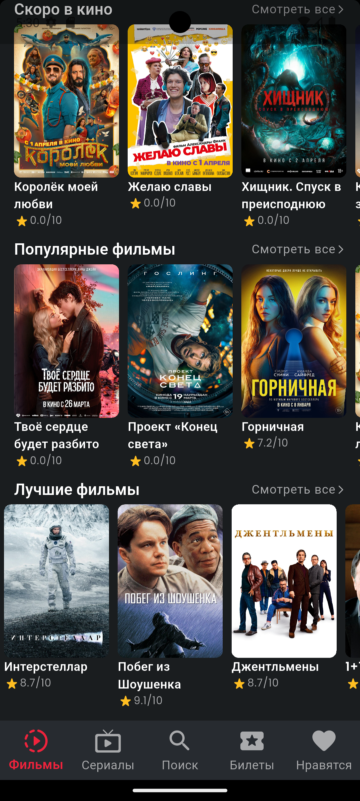
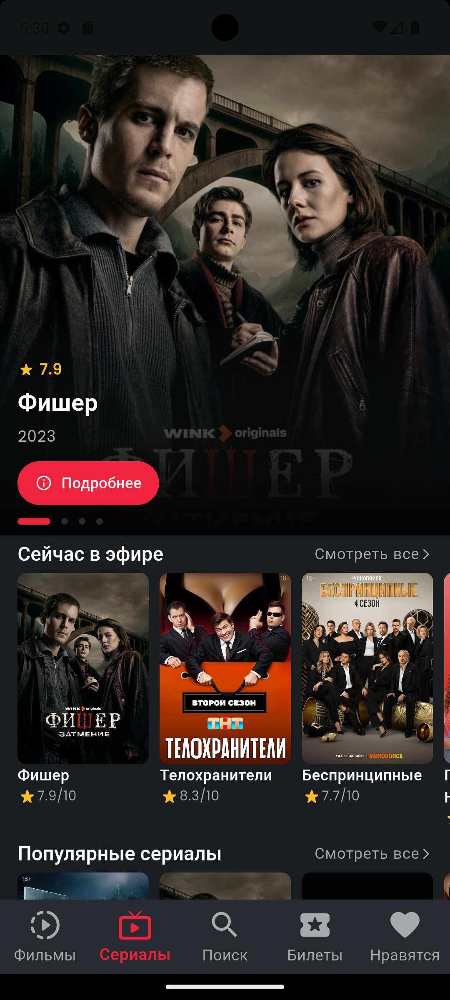
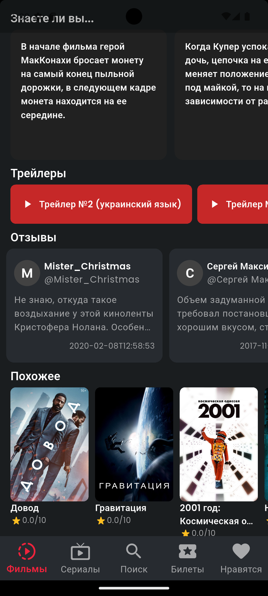
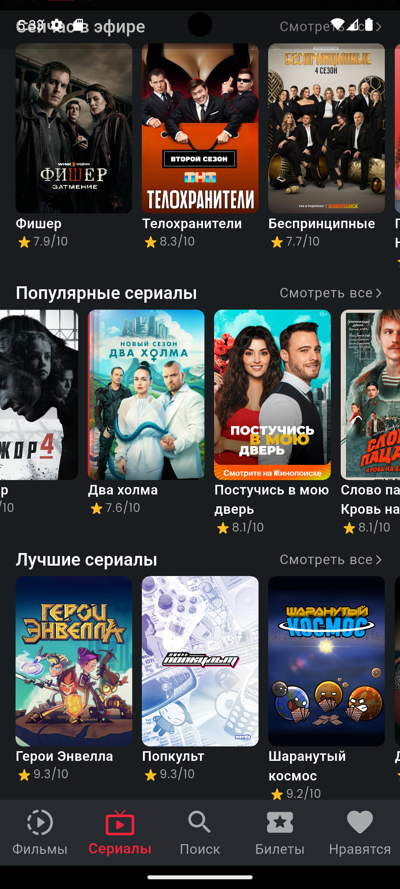

# КиноБаза 🎬

Информационное приложение о фильмах и сериалах на Flutter, использующее API Кинопоиска. Разработано с применением Clean Architecture, BLoC, Hive.

> ⚠️ Для работы приложения необходим API ключ. Можно использовать один из двух вариантов на выбор:
>
> - **Неофициальный API Кинопоиска** — [kinopoiskapiunofficial.tech](https://kinopoiskapiunofficial.tech) — бесплатно, 500 запросов в день
> - **Официальный API Кинопоиска** — [kinopoisk.dev](https://kinopoisk.dev) — бесплатно 200 запросов в день, есть платные тарифы

---

## 📸 Скриншоты

<p>
  
  
  
  
  
  
  
  
  
</p>

---

## 📱 Возможности

### Фильмы
- Сейчас в кино
- Скоро в кино (премьеры)
- Популярные фильмы
- Топ рейтинга
- Классика (фильмы до 2000 года)
- Детали фильма: описание, режиссёр, страна
- Актёрский состав
- Кадры из фильма
- Факты "Знаете ли вы..."
- Сиквелы и приквелы
- Трейлеры (Кинопоиск виджет)
- Рецензии
- Похожие фильмы
- Кнопка "Смотреть на Кинопоиск" с реферальной ссылкой

### Сериалы
- Сейчас в эфире
- Популярные сериалы
- Топ рейтинга
- Классика сериалов
- Детали сериала
- Актёрский состав
- Кадры
- Факты
- Трейлеры
- Рецензии
- Похожие сериалы

### Билеты в кино
- Список премьер текущего месяца
- Красивый баннер главного фильма
- Горизонтальный список с датами премьер
- Кнопка "Купить билет" с реферальной ссылкой

### Общее
- Поиск по всей базе Кинопоиска (1 000 000+ фильмов)
- Watchlist — сохранение фильмов и сериалов
- Бесконечная прокрутка в списках
- Офлайн хранение избранного через Hive

---

## 🏗️ Архитектура

Проект построен на **Clean Architecture** с разделением на слои:

- **Domain** — бизнес-логика, entities, use cases
- **Data** — модели данных, репозитории, remote data sources
- **Presentation** — UI, BLoC контроллеры

Управление состоянием: **BLoC / Cubit**
Навигация: **GoRouter**
Локальное хранилище: **Hive**
HTTP клиент: **Dio**

---

## 🚀 Установка

### 1. Клонировать репозиторий

```bash
git clone https://gitverse.ru/danlarin/kinobaza.git
cd kinobaza
```

### 2. Установить зависимости

```bash
flutter pub get
```

### 3. Настроить переменные окружения

Создай файл `.env` в корне проекта:
API_KEY=твой_api_ключ
API_BASE_URL=https://kinopoiskapiunofficial.tech

Получить бесплатный API ключ:
- [kinopoiskapiunofficial.tech](https://kinopoiskapiunofficial.tech) — 500 запросов в день
- [kinopoisk.dev](https://kinopoisk.dev) — 200 запросов в день

### 4. Запустить приложение

```bash
flutter run
```

---

## 📦 Пакеты

| Пакет | Назначение |
|-------|-----------|
| [flutter_bloc](https://pub.dev/packages/flutter_bloc) | Управление состоянием |
| [go_router](https://pub.dev/packages/go_router) | Навигация |
| [dio](https://pub.dev/packages/dio) | HTTP запросы |
| [hive](https://pub.dev/packages/hive) | Локальное хранилище |
| [hive_flutter](https://pub.dev/packages/hive_flutter) | Hive для Flutter |
| [flutter_dotenv](https://pub.dev/packages/flutter_dotenv) | Переменные окружения |
| [get_it](https://pub.dev/packages/get_it) | Dependency Injection |
| [equatable](https://pub.dev/packages/equatable) | Сравнение объектов |
| [dartz](https://pub.dev/packages/dartz) | Функциональное программирование |
| [cached_network_image](https://pub.dev/packages/cached_network_image) | Кэширование изображений |
| [shimmer](https://pub.dev/packages/shimmer) | Эффект загрузки |
| [carousel_slider](https://pub.dev/packages/carousel_slider) | Слайдер на главной |
| [url_launcher](https://pub.dev/packages/url_launcher) | Открытие ссылок |
| [webview_flutter](https://pub.dev/packages/webview_flutter) | Трейлеры внутри приложения |
| [google_fonts](https://pub.dev/packages/google_fonts) | Шрифты |
| [readmore](https://pub.dev/packages/readmore) | Раскрываемый текст |

---

## ⚙️ Требования

- Flutter 3.x и выше
- Dart 3.x и выше
- Android 5.0 (API 21) и выше
- iOS 12.0 и выше
- API ключ на выбор: kinopoiskapiunofficial.tech или kinopoisk.dev

---

## 📝 Важные замечания

- Трейлеры через Кинопоиск виджет работают **только с российского IP**
- Бесплатный API ключ kinopoiskapiunofficial.tech имеет лимит **500 запросов в день**
- При открытии деталей фильма тратится ~7 запросов
- Для продакшена рекомендуется платный тариф API

---

## ☕ Поддержать проект

Если проект оказался полезным и ты хочешь поддержать его развитие — буду очень благодарен! Любая сумма мотивирует продолжать работу над проектом 🙏

[💳 Поддержать донатом](https://yoomoney.ru/fundraise/1GV365N919A.260405)

---

## 📄 Лицензия

MIT License — используй свободно, но указывай авторство.